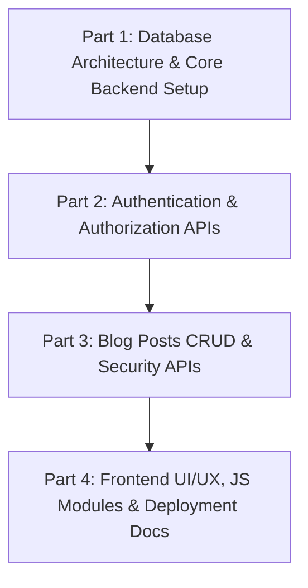

# Project Implementation Plan: Blog_nest Application

**Course / Context:** IN2120 Web Programming  
**Tech Stack:** HTML5, Modern Vanilla CSS, Vanilla JavaScript (ES6+), PHP 8+ (PDO), MySQL  
**Architecture:** Decoupled Client-Server Architecture (RESTful JSON APIs + Lightweight Vanilla Frontend)  

---

## 📋 1. Project Overview & Requirements Analysis

The **Blog_nest** project is a secure, responsive, full-stack blog application designed for standard LAMP/WAMP/XAMPP environments and free shared PHP hosting (e.g., InfinityFree, 000webhost). It delivers a seamless blogging platform where anyone can read articles, while authenticated users can author and manage their own Markdown-powered blog posts.

### Core Architectural & Technical Requirements
- **Frontend:** Semantic HTML5, Vanilla CSS3 (CSS variables, modern responsive Grid & Flexbox, no frameworks unless explicitly requested), and Vanilla JavaScript (ES6 Modules, Fetch API, DOM manipulation).
- **Markdown Support:** Client-side Markdown rendering for rich articles (using `marked.js` via CDN with local fallback) and live editor preview.
- **Backend:** Pure PHP (clean, procedural or simple OOP with PDO), avoiding heavy frameworks (Laravel, Symfony).
- **Database:** MySQL relational database with strict foreign key constraints (`ON DELETE CASCADE`) and prepared statements.
- **Security & Authorization:** 
  - One-way password hashing using `password_hash()` and `password_verify()` with `PASSWORD_DEFAULT`.
  - PHP session management (`$_SESSION`) for authentication state.
  - Server-side authorization: checking `post.user_id === $_SESSION['user_id']` on every update and delete mutation (returning `403 Forbidden` if unauthorized).
  - SQL Injection prevention using PDO parameterized queries.
  - XSS sanitization and robust input validation.
- **Zero Build Tools:** No Node.js, Webpack, Vite, or React dependencies. Ready for direct file transfer via FTP.

---

## 🗂️ 2. Target Project Directory Structure

```text
Blog_nest/
├── backend/
│   ├── config/
│   │   └── db.php                  # PDO database connection & error handling
│   ├── includes/
│   │   ├── auth_check.php          # Session validation & ownership verification helper
│   │   └── response_helper.php     # Standardized JSON response & sanitization utilities
│   └── api/
│       ├── register.php            # User registration endpoint (POST)
│       ├── login.php               # User login endpoint (POST)
│       ├── logout.php              # User logout endpoint (POST/GET)
│       ├── auth_status.php         # Check current authenticated user session (GET)
│       ├── posts_list.php          # List all blog posts with excerpts & author (GET)
│       ├── posts_read.php          # Fetch single post by ID (GET)
│       ├── posts_create.php        # Create a new blog post (POST, Auth required)
│       ├── posts_update.php        # Update existing post (POST/PUT, Owner only)
│       └── posts_delete.php        # Delete post (POST/DELETE, Owner only)
├── public/ (or web root)
│   ├── index.html                  # Home page / Blog feed
│   ├── post.html                   # Single blog post reader view
│   ├── editor.html                 # Create & Edit post with live Markdown preview
│   ├── login.html                  # User login page
│   ├── register.html               # User registration page
│   ├── css/
│   │   └── style.css               # Responsive design system & component styles
│   └── js/
│       ├── auth.js                 # Auth form handling & dynamic navigation state
│       ├── editor.js               # Editor logic, query parameter handling & Markdown preview
│       └── app.js                  # Feed rendering, single post view & delete confirmation modal
├── schema.sql                      # Database schema and seed data for phpMyAdmin
├── .env.example                    # Sample database credentials configuration
├── implementation.md               # 4-part modular project execution plan
└── README.md                       # Comprehensive local & free hosting deployment guide
```

---

# 🚀 3. 4-Part Work Breakdown Structure



---

## 🔹 Part 1: Database Architecture & Core Backend Foundation

### 1.1 Goals & Objectives
Set up the relational MySQL database schema, configure the PDO database connection with error handling and configurable credentials, and establish reusable backend helper scripts for standardized JSON responses and session/authorization checks.

### 1.2 Tasks & Deliverables

1. **Database Schema & Seed Data (`schema.sql`):**
   - **`user` Table:**
     - `id INT AUTO_INCREMENT PRIMARY KEY`
     - `username VARCHAR(50) NOT NULL UNIQUE`
     - `email VARCHAR(100) NOT NULL UNIQUE`
     - `password VARCHAR(255) NOT NULL` (accommodates 60+ character bcrypt hashes)
     - `role VARCHAR(20) DEFAULT 'user'`
     - `created_at TIMESTAMP DEFAULT CURRENT_TIMESTAMP`
   - **`blogPost` Table:**
     - `id INT AUTO_INCREMENT PRIMARY KEY`
     - `user_id INT NOT NULL`
     - `title VARCHAR(255) NOT NULL`
     - `content TEXT NOT NULL` (stores raw Markdown string)
     - `created_at TIMESTAMP DEFAULT CURRENT_TIMESTAMP`
     - `updated_at TIMESTAMP DEFAULT CURRENT_TIMESTAMP ON UPDATE CURRENT_TIMESTAMP`
     - `FOREIGN KEY (user_id) REFERENCES user(id) ON DELETE CASCADE`
   - **Seed Data:**
     - 2 sample test users with pre-hashed passwords (`password_hash('password123', PASSWORD_DEFAULT)`).
     - 4 diverse sample blog posts containing rich Markdown formatting (headings, code blocks, lists, quotes).

2. **Database Connection Configuration (`backend/config/db.php`):**
   - PDO instantiation with UTF-8 character encoding (`utf8mb4`).
   - Default configuration for local development (`localhost`, `root`, blank password, db: `blog_nest`).
   - Support for environment variables or clear placeholder constants for seamless InfinityFree / 000webhost deployment.
   - PDO error mode set to `PDO::ERRMODE_EXCEPTION` and default fetch mode `PDO::FETCH_ASSOC`.
   - Creation of `.env.example` file for reference.

3. **Backend Helper Utilities (`backend/includes/`):**
   - `response_helper.php`:
     - `send_json_response($status, $message, $data = null, $http_code = 200)`: Sets HTTP status code and `Content-Type: application/json`, and outputs JSON.
     - `get_json_input()`: Helper to extract and decode incoming JSON payloads or `$_POST` form data.
     - `sanitize_input($data)`: Sanitizes strings while preserving necessary Markdown syntax.
     - `generate_excerpt($markdown_content, $length = 150)`: Helper to strip Markdown formatting and create clean card excerpts.
   - `auth_check.php`:
     - Safe session starter (`session_status() === PHP_SESSION_NONE`).
     - `is_authenticated()`: Helper returning boolean.
     - `require_auth()`: Returns `401 Unauthorized` JSON response if not logged in.
     - `verify_post_ownership($pdo, $post_id, $user_id)`: Validates post existence (404) and author ownership (403).

---

## 🔹 Part 2: Authentication & Authorization API Endpoints

### 2.1 Goals & Objectives
Implement the complete user authentication lifecycle with PHP native sessions, secure password hashing, robust input validation, and an endpoint for frontend navigation synchronization.

### 2.2 Tasks & Deliverables

1. **User Registration Endpoint (`backend/api/register.php`):**
   - HTTP Method: `POST` (receives JSON or form-data).
   - Validations:
     - Username (3–50 chars, alphanumeric + underscores).
     - Email validation via `filter_var(..., FILTER_VALIDATE_EMAIL)`.
     - Password minimum length (6+ characters).
     - Unique check for username and email against `user` table.
   - Action: Hash password using `password_hash($password, PASSWORD_DEFAULT)` and insert user.
   - Response: `201 Created` on success with success message.

2. **User Login Endpoint (`backend/api/login.php`):**
   - HTTP Method: `POST`.
   - Validations: Required fields check for identifier (username or email) and password.
   - Action: Fetch user by username/email, verify password with `password_verify($password, $user['password'])`.
   - Session Initialization: Sets `$_SESSION['user_id'] = $user['id']`, `$_SESSION['username'] = $user['username']`, `$_SESSION['role'] = $user['role']`.
   - Response: `200 OK` returning sanitized user profile (excluding password hash).

3. **User Logout Endpoint (`backend/api/logout.php`):**
   - HTTP Method: `POST` / `GET`.
   - Action: Clears `$_SESSION = []`, destroys session via `session_destroy()`, and expires session cookie.
   - Response: `200 OK` with logout confirmation message.

4. **Session Status Check Endpoint (`backend/api/auth_status.php`):**
   - HTTP Method: `GET`.
   - Action: Returns `authenticated: true/false` and user metadata (`id`, `username`, `role`).
   - Purpose: Allows frontend pages to immediately adapt navigation items (e.g., Login/Register vs. Username/New Post/Logout).

---

## 🔹 Part 3: Blog Posts REST API Endpoints (CRUD & Security)

### 3.1 Goals & Objectives
Create the complete RESTful CRUD operations for blog posts with strict server-side validation and ownership verification.

### 3.2 Tasks & Deliverables

1. **List All Blog Posts (`backend/api/posts_list.php`):**
   - HTTP Method: `GET`.
   - Access: Public (no login required).
   - Query: `SELECT b.id, b.title, b.content, b.created_at, b.updated_at, b.user_id, u.username AS author FROM blogPost b JOIN user u ON b.user_id = u.id ORDER BY b.created_at DESC`.
   - Features: Generates clean 150-character plain-text excerpts for card feeds.
   - Response: `200 OK` with array of post objects.

2. **Read Single Post Details (`backend/api/posts_read.php`):**
   - HTTP Method: `GET` with parameter `?id={id}`.
   - Access: Public.
   - Query: Fetch full post content, author details, creation timestamp, and update timestamp.
   - Response: `200 OK` with complete post object; `404 Not Found` if the post does not exist.

3. **Create New Blog Post (`backend/api/posts_create.php`):**
   - HTTP Method: `POST`.
   - Access: Authenticated users only (`require_auth()`).
   - Validations: Title (required, 3–255 chars), Content (required, non-empty Markdown).
   - Action: Inserts post into `blogPost` with `user_id = $_SESSION['user_id']`.
   - Response: `201 Created` with created post ID.

4. **Update Existing Blog Post (`backend/api/posts_update.php`):**
   - HTTP Method: `POST` / `PUT` with `id`, `title`, and `content`.
   - Access: Authenticated post owner only.
   - Security Verification:
     - Verify post existence (`404 Not Found` if missing).
     - Verify `post.user_id === $_SESSION['user_id']` (`403 Forbidden` if unauthorized).
   - Action: Updates title and content; `updated_at` updates automatically.
   - Response: `200 OK` with update confirmation.

5. **Delete Blog Post (`backend/api/posts_delete.php`):**
   - HTTP Method: `POST` / `DELETE` with `id`.
   - Access: Authenticated post owner only.
   - Security Verification: Check post existence and verify ownership. If non-owner attempts deletion, block and return `403 Forbidden`.
   - Action: Deletes post record from `blogPost`.
   - Response: `200 OK` with deletion confirmation.

---

## 🔹 Part 4: Frontend Development, UI/UX, Integration & Documentation

### 4.1 Goals & Objectives
Build a modern, responsive, aesthetic user interface using semantic HTML5, Vanilla CSS3, and modular Vanilla JavaScript. Wire all client-side actions to the PHP backend via `fetch()`, and provide complete local and deployment documentation.

### 4.2 Tasks & Deliverables

1. **Modern CSS Design System (`public/css/style.css`):**
   - Curated HSL color palette (dark indigo accents, crisp clean light backgrounds, rich primary brand colors).
   - Typography: Clean Google Fonts (`Inter` / `Outfit` / `Fira Code` for code blocks).
   - Components: Glassmorphic sticky header, hero section, card grid, badge tags, single-column readable article layout, rendered Markdown styles (headings, blockquotes, syntax code boxes, tables), accessible form fields, button states, modal dialogs, and toast notifications.
   - Fully responsive across mobile, tablet, and desktop viewports.

2. **Frontend HTML Pages (`public/`):**
   - `index.html`: Home page displaying hero banner, search/filter bar, grid of blog post cards (title, excerpt, author, date), empty state handling.
   - `post.html`: Reader container, post meta header, markdown-rendered HTML content area, conditional Author Action Toolbar (Edit and Delete buttons shown only if the logged-in user is the author), delete confirmation modal.
   - `editor.html`: Post title input, Markdown textarea, live split-pane/toggle preview powered by `marked.js`, Publish/Save changes button, Cancel button. Supports both Create mode (no query params) and Edit mode (`?id=123`).
   - `login.html` & `register.html`: Clean auth cards with client-side validation, error alerts, and redirect handling after successful auth.

3. **Vanilla JavaScript Modules (`public/js/`):**
   - `auth.js`: Handles login/register form submissions, logout trigger, queries `auth_status.php` on page load, dynamically updates header navigation (showing user greeting and New Post button when logged in, or Login/Register when guest).
   - `app.js`: Fetches posts from `posts_list.php`, renders cards to DOM, handles single post view in `post.html`, handles markdown rendering via `marked.parse()`, controls delete confirmation modal and API call.
   - `editor.js`: Detects `?id=` query parameter. If present, fetches existing post data from `posts_read.php` to populate form fields. Handles real-time Markdown preview and sends create/update requests.

4. **Documentation & Deployment Guide (`README.md`):**
   - Local installation steps for XAMPP / WAMP / MAMP (placing in `htdocs` or `www`).
   - phpMyAdmin database creation and `schema.sql` import steps.
   - Free PHP shared hosting deployment guide (InfinityFree / 000webhost):
     - FTP file upload to `htdocs` / `public_html`.
     - Remote MySQL database and user creation.
     - Updating `backend/config/db.php` with hosting credentials.
   - Post-deployment manual verification checklist (auth test, post creation, markdown rendering, cross-user editing security).

---

## 📊 Summary Matrix of the 4 Parts

| Part | Focus Area | Key Technologies | Main Deliverables |
| :--- | :--- | :--- | :--- |
| **Part 1** | Database Architecture & Core Backend Setup | MySQL, SQL, PHP 8+ (PDO) | `schema.sql`, `.env.example`, `backend/config/db.php`, `backend/includes/auth_check.php`, `backend/includes/response_helper.php` |
| **Part 2** | Authentication & Authorization APIs | PHP Sessions, Bcrypt, JSON API | `backend/api/register.php`, `backend/api/login.php`, `backend/api/logout.php`, `backend/api/auth_status.php` |
| **Part 3** | Blog Posts CRUD & Security APIs | PHP (PDO), Prepared Statements, REST | `backend/api/posts_list.php`, `backend/api/posts_read.php`, `backend/api/posts_create.php`, `backend/api/posts_update.php`, `backend/api/posts_delete.php` |
| **Part 4** | Frontend UI/UX, JS Modules & Deployment Docs | HTML5, Vanilla CSS3, Vanilla JS, Marked.js, Markdown | `public/*.html`, `public/css/style.css`, `public/js/*.js`, `README.md` |

---

## 🔒 Security & Quality Assurance Matrix

- **SQL Injection:** 100% prevented via PDO prepared statements and bound parameters.
- **XSS Prevention:** Input sanitization on the server, HTML escaping for text nodes, and safe markdown rendering.
- **Broken Access Control:** Server-side validation of `$_SESSION['user_id'] === $post['user_id']` on every update and delete action before executing any SQL mutation.
- **Password Security:** One-way hashing with `PASSWORD_DEFAULT` (cost factor tuned for security and performance).
